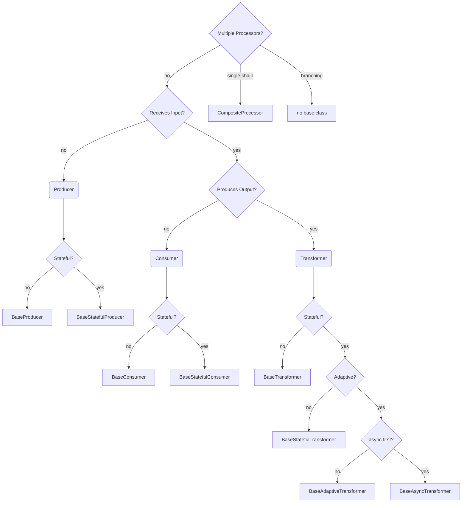

## Processor Base Classes

The `ezmsg.sigproc.base` module contains the base classes for the signal processors. The base classes are designed to allow users to create custom signal processors with minimal errors and minimal repetition of boilerplate code.

> The information below was written at the time of a major refactor to `ezmsg.sigproc.base` to help collate the design decisions and to help with future refactoring.  However, it may be outdated or incomplete. Please refer to the source code for the most accurate information.

### Generic TypeVars

| Idx | Class                     | Description                                                                 |
|-----|---------------------------|-----------------------------------------------------------------------------|
| 1   | `MessageType` (M)         | for messages                                                                |
| 2   | `SettingsType`            | bound to ez.Settings                                                        |
| 3   | `StateType` (St)          | bound to ProcessorState which is simply ez.State with a `hash: int` field.  |

### Protocols

| Idx | Class                 | Parent | State | `__call__` | `stateful_op` | @state | partial_fit |
|-----|-----------------------|--------|-------|------------|---------------|--------|-------------|
| 1   | `Processor`           | -      | No    | [M, None]  | -             | -      | -           |
| 2   | `Producer`            | -      | No    | M          | -             | -      | -           |
| 3   | `Consumer`            | 1      | No    | None       | -             | -      | -           |
| 4   | `Transformer`         | 1      | No    | M          | -             | -      | -           |
| 5   | `StatefulProcessor`   | -      | Yes   | [M, None]  | St, [M, None] | Y      | -           |
| 6   | `StatefulProducer`    | -      | Yes   | M          | St, M         | Y      | -           |
| 7   | `StatefulConsumer`    | 5      | Yes   | None       | St, None      | Y      | -           |
| 8   | `StatefulTransformer` | 5      | Yes   | M          | St, M         | Y      | -           |
| 9   | `AdaptiveTransformer` | 8      | Yes   | M          | St, M         | Y      | Y           |

Note: `__call__` and `partial_fit` both have asynchronous alternatives: `__acall__` and `apartial_fit` respectively.

### Abstract implementations (Base Classes) for standalone processors

| Idx | Class                     | Parent | Protocol | Features                                                                           |
|-----|---------------------------|--------|----------|------------------------------------------------------------------------------------|
| 1   | `BaseProcessor`           | -      | 1        | `__init__` for settings; `__call__` (alias: `send`) wraps abstract `_process`.     |
| 2   | `BaseProducer`            | -      | 2        | Similar to `BaseProcessor`; next/anext instead of send/asend aliases. async first! |
| 3   | `BaseConsumer`            | 1      | 3        | Override return types only                                                         |
| 4   | `BaseTransformer`         | 1      | 4        | Override return types only                                                         |
| 5   | `BaseStatefulProcessor`   | 1      | 5        | `state` setter unpickles arg; `stateful_op` wraps `__call__`                       |
| 6   | `BaseStatefulProducer`    | 2      | 6        | `state` setter and getter; `stateful_op` wraps `__call__` which runs `__acall__`.  |
| 7   | `BaseStatefulConsumer`    | 5      | 7        | Override return types only                                                         |
| 8   | `BaseStatefulTransformer` | 5      | 8        | Override return types only                                                         |
| 9   | `BaseAdaptiveTransformer` | 8      | 9        | Implements `partial_fit`. __call__` may call partial_fit if message has .trigger   |
| 10  | `BaseAsyncTransformer`    | 8      | 8        | `__acall__` wraps abstract `_aprocess`; `__call__` runs `__acall__`.               |
| 11  | `CompositeProcessor`      | 1      | 5        | Methods iterate over sequence of processors created in `_initialize_processors`.   |

Note: For most base classes, the async methods simply call the synchronous methods. Exceptions are `BaseProducer` (and its children) and `BaseAsyncTransformer` which are async-first. For async-first classes, the logic is implemented in the async methods and the sync methods are thin wrappers around them. The wrapper uses a helper method called `run_coroutine_sync` to run the async method in a synchronous context, but this adds some overhead and synchronous calls should be avoided if possible, either by using an async context or by overriding the sync methods with the same logic without needing async.

### Generic TypeVars for ezmsg Units

| Idx | Class                     | Description                                                                                 |
|-----|---------------------------|---------------------------------------------------------------------------------------------|
| 4   | `ProducerType`            | bound to BaseProducer, BaseStatefulProducer                                                 |
| 5   | `ConsumerType`            | bound to BaseConsumer, BaseStatefulConsumer                                                 |
| 6   | `TransformerType`         | bound to BaseTransformer, BaseStatefulTransformer, BaseAsyncTransformer, CompositeProcessor |
| 7   | `AdaptiveTransformerType` | bound to BaseAdaptiveTransformer                                                            |


### Abstract implementations (Base Classes) for ezmsg Units using processors:

| Idx | Class                         | Parents | Expected TypeVars         |
|-----|-------------------------------|---------|---------------------------|
| 1   | `BaseConsumerUnit`            | -       | `ConsumerType`            |
| 2   | `BaseProducerUnit`            | -       | `ProducerType`            |
| 3   | `BaseTransformerUnit`         | 1       | `TransformerType`         |
| 4   | `BaseAdaptiveTransformerUnit` | 3       | `AdaptiveTransformerType` |


## Implementing a custom standalone processor

1. Create a new settings dataclass: `class MySettings(ez.Settings):`
2. Create a new state dataclass: `class MyState(ProcessorState):`
3. Decide on your base processor class, considering the protocol, whether it should be async-first, and other factors.



4. Implement the child class.
    * The minimum implementation is `_process` for sync processors and `_aprocess` for async processors.
    * For any stateful processor, implement `_reset_state`.
    * For stateful processors that need to respond to a change in the incoming data, implement `_hash_message`.
    * See processors in `ezmsg.sigproc` for examples.
5. Override non-abstract methods if you need special behaviour. For example:
    * `WindowTransformer` overrides `__init__` to do some sanity checks on the provided settings.
    * `TransposeTransformer` and `WindowTransformer` override `__call__` to provide a passthrough shortcut when the settings allow for it.

## Implementing a custom ezmsg Unit

1. Create and test custom standalone processor as above.
2. Decide which base unit to implement.
    * Use the "Generic TypeVars for ezmsg Units" table above to determine the expected TypeVar.
    * Fine the Expected TypeVar in the "ezmsg Units" table. 
3. Create the derived class.

Often, all that is required is the following (e.g., for a custom transformer):

```Python
class CustomUnit(TransformerUnit[
        CustomTransformerSettings,    # SettingsType
        AxisArray,                    # MessageType
        CustomTransformer,            # TransformerType
    ]):
        SETTINGS = CustomTransformerSettings
```